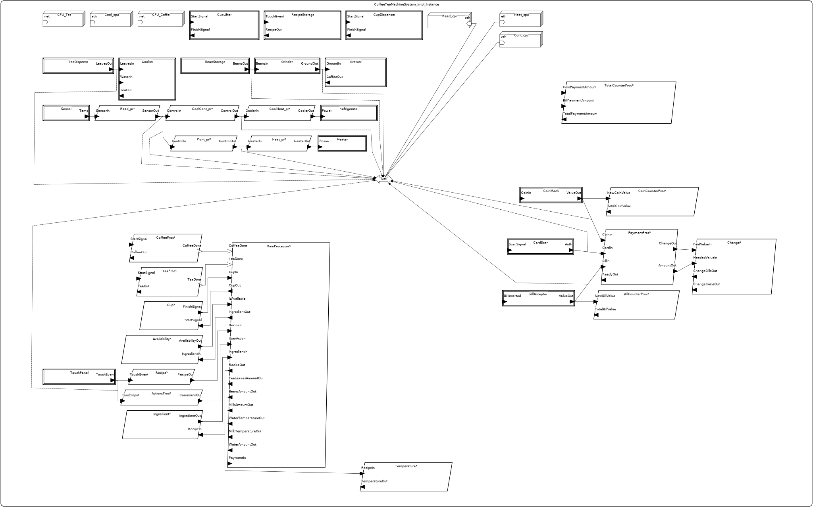

# RTS vending machine

## Authors' data

Konrad Armatys, karmatys@student.agh.edu.pl

Mikołaj Nietupski, mnietupski@student.agh.edu.pl

## Description

This project is an AADL (Architecture Analysis & Design Language) model of a vending machine with hot and cold beverages. The system consists of multiple interconnected components - both hardware and software - enabling users to make payments in cash (coins and notes) or by credit card and select drinks that will be automatically prepared.

## System functionalities

-   Preparing hot coffee (along with grinding coffee beans)
-   Preparing hot tea out of fresh leaves
-   Refrigerating, preparing and dispensing cold drinks
-   Processing and integrating payment in cash (coins + notes / bills) and by credit card.
-   Allowing the user to intuitively select their drinks using an interactive touch panel.
-   Storing different beverage recipes in the machine's memory.
-   Automatic cup dispensing and lifting, so that the user does not have to do anything while their drink is being prepared.

## AADL Components

### Data

-   `TemperatureType` - Represents the value of temperature in the unit used in the model's implementation, e.g. Celsius degrees, Fahrenheit degrees, Kelvins.
-   `HeaterControlType` - Contains the information on whether the heater is turned on or off. Applies to the preparation of hot beverages.
-   `CoolerControlType` - Contains the information on whether the cooler is turned on or off. Applies to the preparation of cold beverages.
-   `TeaLeavesAmount` - Contains the information of the amount of tea leaves that can be used for tea preparation. The unit is dependent on the implementation of the model (e.g. grams, kilograms, pounds).
-   `WaterAmount` - Contains the information on the amount of water that can be used for any beverage preparation. The unit is dependent on the implementation of the model (e.g. litres, ounces).
-   `MilkAmount` - Contains the information on the amount of milk that can be used for specific beverage preparation, such as certain types of coffee. The unit is dependent on the implementation of the model (e.g. litres, ounces).
-   `WaterTemperature` - Contains the information on the current temperature of the water used for beverage preparation.
-   `MilkTemperature` - Contains the information on the current temperature of the milk used for beverage preparation.
-   `LiquidTea` - Contains the volume of liquid tea inside the machine.
-   `BeanAmount` - Contains the amount (e.g. in terms of weight) of coffee beans inside the machine.
-   `GroundCoffee` - Contains the amount (e.g. in terms of weight) of ground coffee.
-   `LiquidCoffee` - Contains the amount (e.g. in terms of volume) of liquid coffee.
-   `StartSignal` - Tells whether the signal to start the machine (and begin beverage preparation) has been sent.
-   `FinishSignal` - Tells whether the signal to stop the machine (and finish beverage preparation) has been sent.
-   `RecipeInfo` - Contains the information on a beverage supplied by the machine.
-   `IngredientInfo` - Contains the information on an ingredient used in beverages (and therefore in recipes for beverages).
-   `IngredientAvailability` - Tells whether a certain ingredient is available. This may determine the possibility of preparing a certain beverage that uses that ingredient.
-   `IsAvailable` - Tells whether a certain beverage is available for preparation by the machine.
-   `CoinSignal` - Determines if a coin is being inserted.
-   `BillSignal` - Determines if a note / bill is being inserted.
-   `CardSignal` - Determines if a credit card is being inserted.
-   `CoinValue` - Keeps the value of the inserted coin(s).
-   `BillValue` - Keeps the value of the inserted note(s) / bill(s).
-   `CardAuthSignal` - Determines if the inserted credit card has been authenticated.
-   `TouchInput` - Contains the information introduced to the system via the touch panel.
-   `UserCommand` - Contains the command that will be executed upon the user's input.
-   `PaymentReady` - Tells whether the payment can be carried on.
-   `PaymentAmount` - Contains the total amount of money that is / will be / has been transferred in a given transaction.

### Devices

-   `TempSensor` Checks the current temperature in a particular spot. May be applied to liquids that are subject to heating or cooling, such as water and milk.
-   `Heater` - Is responsible for heating the liquid beverage ingredients, e.g. water.
-   `Refrigerator` - AKA Cooler. Is responsible for cooling the liquid beverage ingredients, e.g. water.
-   `TeaLeavesDispenser` - Is responsible for dispensing a designated amount of tea leaves (`TeaLeavesAmount`), that will be used for tea preparation.
-   `TeaCooker` - Combines leaves (`LeavesIn`) and water (`WaterWaterIn`) to produce **hot** liquid tea (`TeaOut`).
-   `CoffeeBeansStorage` - Stores (and passes to the grinder) a certain amount of coffee beans (`BeansOut`).
-   `CoffeeGrinder` - Converts a designated amount of coffee beans (`BeansIn`) to a certain amount of ground coffee (`GroundOut`).
-   `CoffeeBrewer` - Converts ground coffee (`GroundCoffee`) into **hot** liquid coffee (`LiquidCoffee`).
-   `RecipeStorage` - Stores recipes for various beverages that can be prepared by the machine on user's command. The user selects the recipe using the machine's touchable panel (`TouchEvent`), which results in returning the details of preparation of the selected beverage (`RecipeOut`).
-   `CupDispenser` - Upon receiving a start signal (`StartSignal`), dispenses a cup and returns a finish signal (`FinishSignal`).
-   `CupLifter` - Upon receiving a start signal (`StartSignal`), lifts a cup and returns a finish signal (`FinishSignal`).
-   `CoinMechanism` - Upon receiving a coin insertion signal (`CoinSignal`), determines the value (`CoinValue`) of the inserted coin.
-   `BillAcceptor` - Upon receiving a note / bill insertion signal (`BillSignal`), determines the value (`BillValue`) of the inserted note / bill.
-   `CardScanner` - Upon receiving a credit card insertion signal (`CardSignal`), returns the result of the card authentication (`CardAuthSignal`).
-   `TouchablePanel` - Gets the current value of the input on the touchable panel (`TouchInput`).

### Threads

-   `GetRecipe` - Based on the input on touch panel (`TouchInput`), returns a particular recipe (`RecipeInfo`). Gets executed every `1600ms` and the execution time ranges from `0ms` to `1ms`.
-   `SelectIngredient` - Takes a recipe (`Recipe`), returns ingredients (`IngredientOut`) for that recipe (similarly to the `IngredientSelector` device, but with specified execution interval and duration).
-   `SelectTemperature` - Takes a recipe (`RecipeIn`) and returns the temperature (`TemperatureOut`) of the liquid used in that recipe.
-   `CheckAvailability` - Takes an ingredient (`IngredientInfo`) and tells whether it is available (`IsAvailable`) to be used in the preparation of the selected beverage.
-   `DispenseCup` - Upon receiving a start signal (`StartSignal`), dispenses a cup and returns a finish signal (`FinishSignal`).
-   `LiftCup` - Upon receiving a start signal (`StartSignal`), lifts a cup and returns a finish signal (`FinishSignal`).
-   `AddCoinValue` - Adds the new coin value (`NewCoinValue`) to the accumulated sum (`TotalCoinValue`).
-   `AddBillValue` - Adds the new bill value (`NewBillValue`) to the accumulated sum (`TotalBillValue`).
-   `MoneyCounterThread` - Sums the total values of coins and bills.
-   `ResolvePaymentAttempt` - Thread for additional payment integration. This thread will be responsible for:
    -   summing the value of coins and notes;
    -   checking whether card payment was authorized;
    -   setting `ReadyOut` to `true` should the user pay enough money.
-   `ReturnChange` - Based on the beverage price (`NeededValueIn`) and actual amount of money paid (`PaidValueIn`), determines the change to be returned (`ChangeValueOut`).
-   `InterpretUserAction` - Take an input (`TouchInput`) from the touch panel and interpret it as a command (`UserCommand`).
-   `ReadTemperature` - Reads the temperature (`TempIn`) from a designated sensor (device) and returns its value (`TempOut`).
-   `ToggleHeater` - If the temperature (`Temp`) of the liquid is too low for the currently prepared beverage, turn on (`HeaterCmd`) the heater. Otherwise, turn it off.
-   `HeaterDriver` - A driver for the heater. Supports powering the heater on and off.
-   `ToggleCooler` - If the temperature (`Temp`) of the liquid is too high for the currently prepared beverage, turn on (`HeaterCmd`) the refrigerator. Otherwise, turn it off.
-   `RefrigerationDriver` - A driver for the refrigerator. Supports powering the refrigerator on and off.
-   `PrepareTea` - On the start signal (`StartSignal`), return the proper amount of tea (`TeaPoured`).
-   `PrepareCoffee` - On the start signal (`StartSignal`), return the proper amount of coffee (`CoffeePoured`).
-   `MainController` - The thread that represents the full logic / flow of the exemplary use case of the vending machine:
    -   Recipe choice by user.
    -   Checking ingredient availability.
    -   Checking if the proper amount of liquid (water or milk) is available.
    -   Making a payment.
    -   Dispensing and lifting the cup
    -   Dispensing necessary ingredients: tea leaves or coffee beans..
    -   Adjusting the liquid (water or milk) temperature.

### Processes

-   `RecipeSelector` - The process for selecting a recipe out of available recipes in the machine.
-   `IngredientForRecipeSelector` - The process for automatic selection of ingredients required to follow a recipe.
-   `TemperatureForRecipeSelector` - The process for automatic selection of temperature needed to follow the recipe.
-   `IngredientAvailabilityChecker` - The process for automatic checking if a particular ingredient is available.
-   `CupControl` - The process for performing operations on a cup, such as dispensing and lifting.
-   `UserActionsInterpreterProcess` - The process for interpreting the user input on the touch panel.
-   `CoinCounter` - The process for summing all individual coin values into the total amount of money.
-   `BillCounter` - The process for summing all individual note / bill values into the total amount of money.
-   `TotalMoneyCounter` - The process for adding the total value of coins and the total value of notes / bills in order to receive the total amount of money deposited.
-   `Payment` - The process for completing a transaction.
-   `ChangeReturner` - The process for returning a change.
-   `TemperatureReading` - The process for reading the temperature from a sensor.
-   `HeaterControl` - The process for turning the heater on or off depending on the temperature.
-   `Heating` - The process for heating liquids. Applies to the preparation of hot drinks.
-   `RefrigeratorControl` - The process for turning the refrigerator on or off depending on the temperature.
-   `Cooling` - The process for cooling liquids. Applies to the preparation of cold drinks.
-   `TeaPreparation` - The process for full tea preparation.
-   `CoffeePreparation` - The process for full coffee preparation.
-   `MainProcessor` - The process for the entire use case of the vending machine.

### Bus

-   `ethernet` - The main bus that accounts for the communication within the system.

### Processors

-   `corei5` - The main processor that deals with the core components of the vending machine.
-   `CoffeeCPU` - The processor dedicated to the coffee preparation mechanism.
-   `TeaCPU` - The processor dedicated to the tea preparation mechanism.

### System

-   `CoffeeTeaMachineSystem` - The full system that combines all other components and accounts for all supported use cases of the vending machine.

## System diagram

## Analyses

### Weight analysis

The following weights have been assigned to the system's hardware components:

| Component            | Type      | Weight (kg) |
| -------------------- | --------- | ----------- |
| `TempSensor`         | device    | 0.050       |
| `Heater`             | device    | 0.800       |
| `Refrigerator`       | device    | 1.500       |
| `TeaLeavesDispenser` | device    | 0.400       |
| `TeaCooker`          | device    | 1.200       |
| `CoffeeBeansStorage` | device    | 0.500       |
| `CoffeeGrinder`      | device    | 1.000       |
| `CoffeeBrewer`       | device    | 1.300       |
| `RecipeStorage`      | device    | 0.200       |
| `CupDispenser`       | device    | 0.700       |
| `CupLifter`          | device    | 0.900       |
| `CoinMechanism`      | device    | 0.600       |
| `BillAcceptor`       | device    | 0.650       |
| `CardScanner`        | device    | 0.350       |
| `TouchablePanel`     | device    | 0.500       |
| `corei5`             | processor | 0.100       |
| `CoffeeCPU`          | processor | 0.070       |
| `TeaCPU`             | processor | 0.070       |
| `ethernet`           | bus       | 0.200       |

**Report**

> Weight totals Report
>
> -   Net: [L] Sum of weights / gross weight is 0.200 kg (no limit specified)
> -   Sensor: [L] Sum of weights / gross weight is 0.050 kg (no limit specified)
> -   Heater: [L] Sum of weights / gross weight is 0.800 kg (no limit specified)
> -   Refrigerator: [L] Sum of weights / gross weight is 1.500 kg (no limit specified)
> -   TeaDispense: [L] Sum of weights / gross weight is 0.400 kg (no limit specified)
> -   Cooker: [L] Sum of weights / gross weight is 1.200 kg (no limit specified)
> -   BeanStorage: [L] Sum of weights / gross weight is 0.500 kg (no limit specified)
> -   Grinder: [L] Sum of weights / gross weight is 1.000 kg (no limit specified)
> -   Brewer: [L] Sum of weights / gross weight is 1.300 kg (no limit specified)
> -   CoinMech: [L] Sum of weights / gross weight is 0.600 kg (no limit specified)
> -   BillAcceptor: [L] Sum of weights / gross weight is 0.650 kg (no limit specified)
> -   CardScan: [L] Sum of weights / gross weight is 0.350 kg (no limit specified)
> -   TouchPanel: [L] Sum of weights / gross weight is 0.500 kg (no limit specified)
> -   RecipeStorage: [L] Sum of weights / gross weight is 0.200 kg (no limit specified)
> -   CupDispenser: [L] Sum of weights / gross weight is 0.700 kg (no limit specified)
> -   CupLifter: [L] Sum of weights / gross weight is 0.900 kg (no limit specified)
> -   Read_cpu: [L] Sum of weights / gross weight is 0.100 kg (no limit specified)
> -   Cont_cpu: [L] Sum of weights / gross weight is 0.100 kg (no limit specified)
> -   Heat_cpu: [L] Sum of weights / gross weight is 0.100 kg (no limit specified)
> -   Cool_cpu: [L] Sum of weights / gross weight is 0.100 kg (no limit specified)
> -   CPU_Coffee: [L] Sum of weights / gross weight is 0.070 kg (no limit specified)
> -   CPU_Tea: [L] Sum of weights / gross weight is 0.070 kg (no limit specified)
> -   CoffeeTeaMachineSystem_impl_Instance: [A] Sum of weights (11.390 kg) is below weight limit of 12.000 kg (5.1 % Weight slack)

### Resource budgets analysis: not bound resource budgets

**Resource Summary**

-   MIPS capacity 1732.800 MIPS : MIPS budget 139.049 MIPS
-   6 out of 6 with MIPS capacity
-   39 out of 39 with MIPS budget

**Detailed Processor MIPS Capacity Report**

| Component            | Capacity      |
| -------------------- | ------------- |
| processor Read_cpu   | 288.800 MIPS  |
| processor Cont_cpu   | 288.800 MIPS  |
| processor Heat_cpu   | 288.800 MIPS  |
| processor Cool_cpu   | 288.800 MIPS  |
| processor CPU_Coffee | 288.800 MIPS  |
| processor CPU_Tea    | 288.800 MIPS  |
| Total                | 1732.800 MIPS |

**Detailed MIPS Budget Report**

| Component                             | Budget      | Actual       | Notes                                                                                                                                |
| ------------------------------------- | ----------- | ------------ | ------------------------------------------------------------------------------------------------------------------------------------ |
| thread Read_pr.TempReader             | 10.000 MIPS | 0.722 MIPS   | thread CoffeeTeaMachineSystem_impl_Instance.Read_pr.TempReader total 0.722 MIPS below budget 10.000 MIPS (92.8 % slack)              |
| process Read_pr                       | 0.000 MIPS  | 0.722 MIPS   |                                                                                                                                      |
| thread Cont_pr.Control                | 10.000 MIPS | 0.722 MIPS   | thread CoffeeTeaMachineSystem_impl_Instance.Cont_pr.Control total 0.722 MIPS below budget 10.000 MIPS (92.8 % slack)                 |
| process Cont_pr                       | 0.000 MIPS  | 0.722 MIPS   |                                                                                                                                      |
| thread Heat_pr.HeaterCtrl             | 10.000 MIPS | 0.722 MIPS   | thread CoffeeTeaMachineSystem_impl_Instance.Heat_pr.HeaterCtrl total 0.722 MIPS below budget 10.000 MIPS (92.8 % slack)              |
| process Heat_pr                       | 0.000 MIPS  | 0.722 MIPS   |                                                                                                                                      |
| thread CoolCont_pr.Cooling            | 10.000 MIPS | 0.722 MIPS   | thread CoffeeTeaMachineSystem_impl_Instance.CoolCont_pr.Cooling total 0.722 MIPS below budget 10.000 MIPS (92.8 % slack)             |
| process CoolCont_pr                   | 0.000 MIPS  | 0.722 MIPS   |                                                                                                                                      |
| thread CoolHeat_pr.CoolerCtrl         | 10.000 MIPS | 0.722 MIPS   | thread CoffeeTeaMachineSystem_impl_Instance.CoolHeat_pr.CoolerCtrl total 0.722 MIPS below budget 10.000 MIPS (92.8 % slack)          |
| process CoolHeat_pr                   | 0.000 MIPS  | 0.722 MIPS   |                                                                                                                                      |
| thread TeaProc.teaLogic               | 10.000 MIPS | 1.083 MIPS   | thread CoffeeTeaMachineSystem_impl_Instance.TeaProc.teaLogic total 1.083 MIPS below budget 10.000 MIPS (89.2 % slack)                |
| process TeaProc                       | 0.000 MIPS  | 1.083 MIPS   |                                                                                                                                      |
| thread CoffeeProc.coffeeLogic         | 10.000 MIPS | 1.083 MIPS   | thread CoffeeTeaMachineSystem_impl_Instance.CoffeeProc.coffeeLogic total 1.083 MIPS below budget 10.000 MIPS (89.2 % slack)          |
| process CoffeeProc                    | 0.000 MIPS  | 1.083 MIPS   |                                                                                                                                      |
| thread CoinCounterProc.counterThread  | 10.000 MIPS | 0.000 MIPS   | thread CoffeeTeaMachineSystem_impl_Instance.CoinCounterProc.counterThread total 0.000 MIPS below budget 10.000 MIPS (100.0 % slack)  |
| process CoinCounterProc               | 0.000 MIPS  | 10.000 MIPS  |                                                                                                                                      |
| thread BillCounterProc.counterThread  | 10.000 MIPS | 0.000 MIPS   | thread CoffeeTeaMachineSystem_impl_Instance.BillCounterProc.counterThread total 0.000 MIPS below budget 10.000 MIPS (100.0 % slack)  |
| process BillCounterProc               | 0.000 MIPS  | 10.000 MIPS  |                                                                                                                                      |
| thread TotalCounterProc.counterThread | 10.000 MIPS | 0.000 MIPS   | thread CoffeeTeaMachineSystem_impl_Instance.TotalCounterProc.counterThread total 0.000 MIPS below budget 10.000 MIPS (100.0 % slack) |
| process TotalCounterProc              | 0.000 MIPS  | 10.000 MIPS  |                                                                                                                                      |
| thread ActionsProc.interpreter        | 10.000 MIPS | 0.963 MIPS   | thread CoffeeTeaMachineSystem_impl_Instance.ActionsProc.interpreter total 0.963 MIPS below budget 10.000 MIPS (90.4 % slack)         |
| process ActionsProc                   | 0.000 MIPS  | 0.963 MIPS   |                                                                                                                                      |
| thread PaymentProc.logic              | 10.000 MIPS | 2.310 MIPS   | thread CoffeeTeaMachineSystem_impl_Instance.PaymentProc.logic total 2.310 MIPS below budget 10.000 MIPS (76.9 % slack)               |
| process PaymentProc                   | 0.000 MIPS  | 2.310 MIPS   |                                                                                                                                      |
| thread MainProcessor.logic            | 30.000 MIPS | 0.000 MIPS   | thread CoffeeTeaMachineSystem_impl_Instance.MainProcessor.logic total 0.000 MIPS below budget 30.000 MIPS (100.0 % slack)            |
| process MainProcessor                 | 0.000 MIPS  | 30.000 MIPS  |                                                                                                                                      |
| thread Change.changeThread            | 10.000 MIPS | 0.000 MIPS   | thread CoffeeTeaMachineSystem_impl_Instance.Change.changeThread total 0.000 MIPS below budget 10.000 MIPS (100.0 % slack)            |
| process Change                        | 0.000 MIPS  | 10.000 MIPS  |                                                                                                                                      |
| thread Recipe.GetRecipe               | 10.000 MIPS | 0.000 MIPS   | thread CoffeeTeaMachineSystem_impl_Instance.Recipe.GetRecipe total 0.000 MIPS below budget 10.000 MIPS (100.0 % slack)               |
| process Recipe                        | 0.000 MIPS  | 10.000 MIPS  |                                                                                                                                      |
| thread Ingredient.SelectIngredient    | 10.000 MIPS | 0.000 MIPS   | thread CoffeeTeaMachineSystem_impl_Instance.Ingredient.SelectIngredient total 0.000 MIPS below budget 10.000 MIPS (100.0 % slack)    |
| process Ingredient                    | 0.000 MIPS  | 10.000 MIPS  |                                                                                                                                      |
| thread Availability.CheckAvailability | 10.000 MIPS | 0.000 MIPS   | thread CoffeeTeaMachineSystem_impl_Instance.Availability.CheckAvailability total 0.000 MIPS below budget 10.000 MIPS (100.0 % slack) |
| process Availability                  | 0.000 MIPS  | 10.000 MIPS  |                                                                                                                                      |
| thread Temperature.SelectTemperature  | 10.000 MIPS | 0.000 MIPS   | thread CoffeeTeaMachineSystem_impl_Instance.Temperature.SelectTemperature total 0.000 MIPS below budget 10.000 MIPS (100.0 % slack)  |
| process Temperature                   | 0.000 MIPS  | 10.000 MIPS  |                                                                                                                                      |
| thread Cup.DispenseCup                | 10.000 MIPS | 0.000 MIPS   | thread CoffeeTeaMachineSystem_impl_Instance.Cup.DispenseCup total 0.000 MIPS below budget 10.000 MIPS (100.0 % slack)                |
| thread Cup.LiftCup                    | 10.000 MIPS | 0.000 MIPS   | thread CoffeeTeaMachineSystem_impl_Instance.Cup.LiftCup total 0.000 MIPS below budget 10.000 MIPS (100.0 % slack)                    |
| process Cup                           | 0.000 MIPS  | 20.000 MIPS  |                                                                                                                                      |
| Total                                 |             | 139.049 MIPS |                                                                                                                                      |

### Resource budget analysis: bound resource budgets

Processor Summary Report:

-   Processor Read_cpu: Total MIPS 0.722 MIPS of bound tasks within MIPS capacity 288.800 MIPS of Read_cpu
-   Processor Cont_cpu: Total MIPS 0.722 MIPS of bound tasks within MIPS capacity 288.800 MIPS of Cont_cpu
-   Processor Heat_cpu: Total MIPS 0.722 MIPS of bound tasks within MIPS capacity 288.800 MIPS of Heat_cpu
-   Processor Cool_cpu: Total MIPS 1.444 MIPS of bound tasks within MIPS capacity 288.800 MIPS of Cool_cpu
-   Processor CPU_Coffee: Total MIPS 1.083 MIPS of bound tasks within MIPS capacity 288.800 MIPS of CPU_Coffee
-   Processor CPU_Tea: Total MIPS 4.356 MIPS of bound tasks within MIPS capacity 288.800 MIPS of CPU_Tea

# Sources

-   [CASE AADL Tutorial](https://github.com/GaloisInc/CASE-AADL-Tutorial/tree/main/aadl_book) - the main source of information on AADL components used in this project
-   [The Components of A Vending Machine - How They Work.](https://www.vendinglocator.com/blog/vending-machine-components) - An article on the Vending Locator website that describes the main components of a vending machine. It served as a go-to reference at the beginning of the process of designing our system.
-   [Inside a Vending: What are the Different Parts of a Machine?](https://www.tcnvending.com.au/inside-a-vending-what-are-the-different-parts-of-a-machine/) - Another good source on the different components of a vending machine that should be taken into account in the process of designing one.
-   [Vending Machine Components and Functions](https://www.vendingmachinepart.com/knowledge/vending-machine-components-and-functions) - Another article on vending machine components, this time with illustrations, which could help us imagine how the designed machine would look like in practice in relation to its inner parts.
